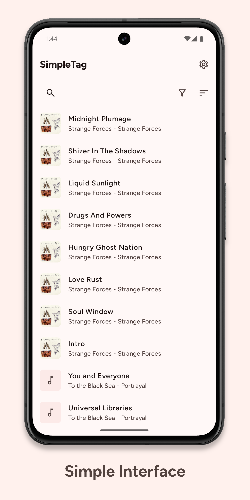
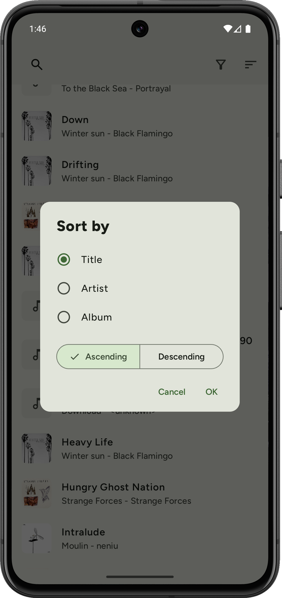
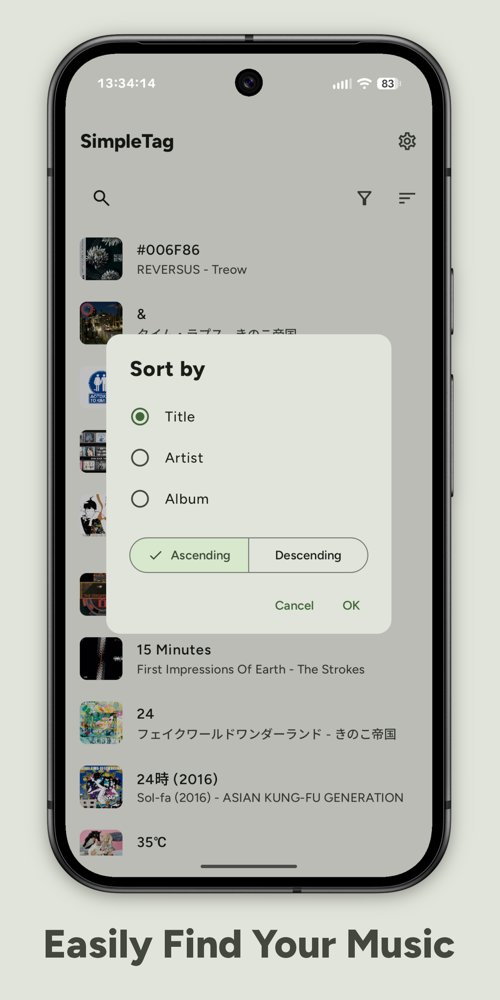
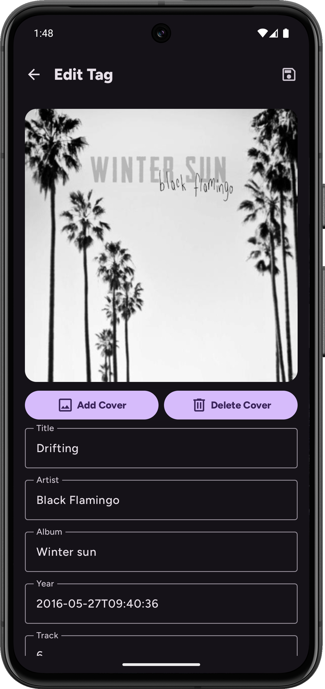

<h1 align="center"><b>SimpleTag</b></h1>
<h4 align="center">A simple, powerful, audio tagger for Android </h4>

    
    
     
    
    
    

 

## About

SimpleTag is a Material You audio tagger built with Jetpack Compose. Supports most major audio and tag formats with jaudiotagger under the hood

## Features 
- MP3, MP4(audio), OGG, FLAC, WAV, AIF, DSF, and WMA audio format support
- ID3v1, ID3v11, ID3v22, ID3v23, ID3v24, and FLAC tag format support
- Supports 50+ of the most popular tag fields (full tag mapping [here](https://www.jthink.net/jaudiotagger/tagmapping.html))
- Batch tag editing (Planned)

## Screenshots

    
    
    
    

## Installation
**Recommended:** Click on the Obtainium badge to add SimpleTag to your Obtainium library (download Obtainium [here](https://obtainium.imranr.dev/))

**Alternatively** download the apk directly from the [releases](https://github.com/sergcam/SimpleTag/releases) section

## License
Copyright (C) 2025  Sergio Camacho

This program is free software: you can redistribute it and/or modify
it under the terms of the GNU General Public License as published by
the Free Software Foundation, either version 3 of the License, or
(at your option) any later version.

This program is distributed in the hope that it will be useful,
but WITHOUT ANY WARRANTY; without even the implied warranty of
MERCHANTABILITY or FITNESS FOR A PARTICULAR PURPOSE.  See the
GNU General Public License for more details.
