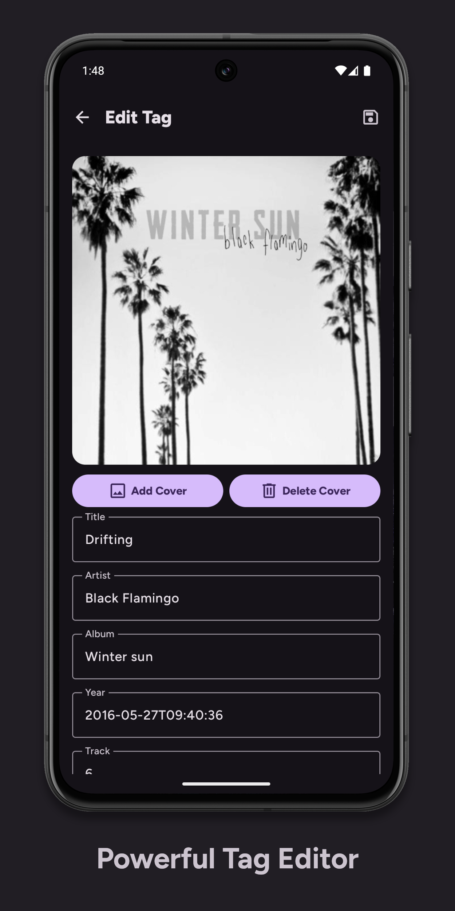
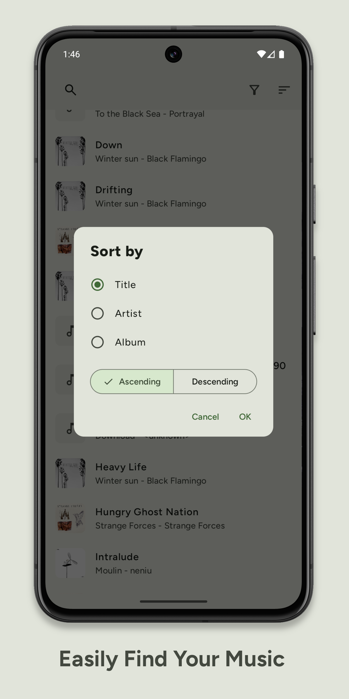

<h1 align="center"><b>SimpleTag</b></h1>
<h4 align="center">A simple, powerful, audio tagger for Android </h4>

    
    
     
    
    
    

 

    <a href="https://apps.obtainium.imranr.dev/redirect?r=obtainium://app/%7B%22id%22%3A%22dev.secam.simpletag%22%2C%22url%22%3A%22https%3A%2F%2Fgithub.com%2Fsergcam%2FSimpleTag%22%2C%22author%22%3A%22sergcam%22%2C%22name%22%3A%22SimpleTag%22%2C%22preferredApkIndex%22%3A0%2C%22additionalSettings%22%3A%22%7B%5C%22includePrereleases%5C%22%3Atrue%2C%5C%22fallbackToOlderReleases%5C%22%3Atrue%2C%5C%22filterReleaseTitlesByRegEx%5C%22%3A%5C%22%5C%22%2C%5C%22filterReleaseNotesByRegEx%5C%22%3A%5C%22%5C%22%2C%5C%22verifyLatestTag%5C%22%3Afalse%2C%5C%22sortMethodChoice%5C%22%3A%5C%22date%5C%22%2C%5C%22useLatestAssetDateAsReleaseDate%5C%22%3Afalse%2C%5C%22releaseTitleAsVersion%5C%22%3Afalse%2C%5C%22trackOnly%5C%22%3Afalse%2C%5C%22versionExtractionRegEx%5C%22%3A%5C%22%5C%22%2C%5C%22matchGroupToUse%5C%22%3A%5C%22%5C%22%2C%5C%22versionDetection%5C%22%3Atrue%2C%5C%22releaseDateAsVersion%5C%22%3Afalse%2C%5C%22useVersionCodeAsOSVersion%5C%22%3Afalse%2C%5C%22apkFilterRegEx%5C%22%3A%5C%22%5C%22%2C%5C%22invertAPKFilter%5C%22%3Afalse%2C%5C%22autoApkFilterByArch%5C%22%3Atrue%2C%5C%22appName%5C%22%3A%5C%22SimpleTag%5C%22%2C%5C%22appAuthor%5C%22%3A%5C%22sergcam%5C%22%2C%5C%22shizukuPretendToBeGooglePlay%5C%22%3Afalse%2C%5C%22allowInsecure%5C%22%3Afalse%2C%5C%22exemptFromBackgroundUpdates%5C%22%3Afalse%2C%5C%22skipUpdateNotifications%5C%22%3Afalse%2C%5C%22about%5C%22%3A%5C%22Simple%2C%20Powerful%2C%20Audio%20Tagger%20for%20Android%5C%22%2C%5C%22refreshBeforeDownload%5C%22%3Afalse%7D%22%2C%22overrideSource%22%3Anull%7D"></a>
    

 

## About

SimpleTag is a Material You audio tagger built with Jetpack Compose. Supports most major audio and tag formats with jaudiotagger under the hood

## Features 
- MP3, MP4(audio), OGG, FLAC, WAV, AIF, DSF, and WMA audio format support
- ID3v1, ID3v11, ID3v22, ID3v23, ID3v24, and FLAC tag format support
- Supports 50+ of the most popular tag fields (full tag mapping [here](https://www.jthink.net/jaudiotagger/tagmapping.html))
- Batch tag editing (Planned)

## Screenshots

    
    
    
    

## Permissions
- `WRITE_EXTERNAL_STORAGE` API29 and below. Used to read and write audio files
- `READ_EXTERNAL_STORAGE` API30-API32. Used to read audio files
- `READ_MEDIA_AUDIO` API33+. Used to read audio files
#### Optional permissions (API31+)
- `MANAGE_MEDIA` Used in combination with `ACCESS_MEDIA_LOCATION` to write to audio files without system pop-up
- `ACCESS_MEDIA_LOCATION` This one is a bit weird:

    From [google](https://developer.android.com/reference/android/Manifest.permission#ACCESS_MEDIA_LOCATION): `Allows an application to access any geographic locations persisted in the user's shared collection.` However it is also for some reason required in conjunction with `MANAGE_MEDIA` to disable the write permission prompt [(docs)](https://developer.android.com/reference/android/Manifest.permission#MANAGE_MEDIA). Also, it shows up as access to photos and videos and "allow all" must be selected because the limited access prompt doesnt let you choose audio files

## Installation
**Recommended:** Click on the Obtainium badge to add SimpleTag to your Obtainium library (download Obtainium [here](https://obtainium.imranr.dev/)) **or** Click on the IzzyOnDroid badge to download through IzzyOnDroid F-Droid repo

**Alternatively** download the apk directly from the [releases](https://github.com/sergcam/SimpleTag/releases) section

## License
Copyright (C) 2025  Sergio Camacho

This program is free software: you can redistribute it and/or modify
it under the terms of the GNU General Public License as published by
the Free Software Foundation, either version 3 of the License, or
(at your option) any later version.

This program is distributed in the hope that it will be useful,
but WITHOUT ANY WARRANTY; without even the implied warranty of
MERCHANTABILITY or FITNESS FOR A PARTICULAR PURPOSE.  See the
GNU General Public License for more details.
